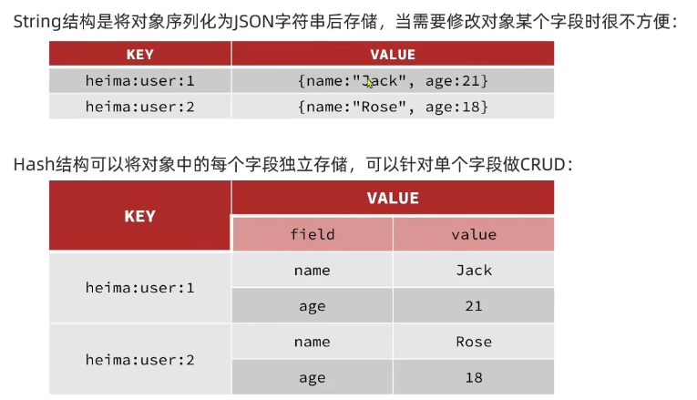
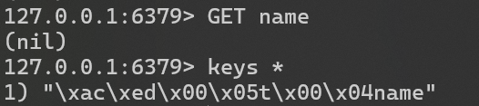

## 初识Redis

键值数据库

nosql 非关系型数据库，键值类型(Redis)，文档类型(MongoDB)，列类型(HBase)，Graph类型(Neo4j)

Structured（结构化）：有键，以及键的约束，结构修改起来很麻烦

对应的非结构化

关系型：表和表之间有关系，非关系型，数据库不会帮忙维护关联

事务性：nosql无法完全保证

nosql天生考虑到了水平（即可以加节点变大，而不是把16升32）的扩展，mysql这种需要引入三方来分库


Redis特征

+ 单线程，每个命令具备原子性，天生没并发问题
+ 键值型，支持数据结构多，功能丰富
+ 低延迟，速度快（基于内存、IO多路服用、良好的编码）
+ 支持数据持久化
+ 支持主从集群（可以做读写拆分）、分片集群（水平扩展）
+ 支持多语言客户端


`redis-server`：启动redis服务端


## Redis常见命令

**Redis数据结构介绍**

key-value数据库，key一般是String类型，value类型多样


**Redis通用命令**

常见：

```bash
# 可以查询对应命令的用法
help EXPIRE
# 匹配所有key，可以使用通配符
KEYS *
# 删除一个指定的key
DEL [key ...]
# 判断一个key是否存在
exists key [key ...]
# 给一个key设置有效期，有效期到期时候key会被自动删除
EXPIRE
## 查看要给KEY的剩余有效期
TTL
```


**String类型**

是Redis中最简单的存储类型

其value是字符串，不过根据格式不同，可以分为普通字符串，整数和浮点

其中整数和浮点会被以二进制形式存放，更省空间，然后相对普通字符串多了自增自减等操作

常见命令：

- `SET`：添加或者修改已经存在的一个 String 类型的键值对
- `GET`：根据 key 获取 String 类型的 value
- `MSET`：批量添加多个 String 类型的键值对
- `MGET`：根据多个 key 获取多个 String 类型的 value
- `INCR`：让一个整型的 key 自增 1
- `INCRBY`：让一个整型的 key 自增并指定步长  
  例如：`INCRBY num 2`，让 `num` 的值自增 2
- `INCRBYFLOAT`：让一个浮点类型的数字自增并指定步长
- `SETNX`：添加一个 String 类型的键值对，前提是这个 key 不存在，否则不执行
- `SETEX`：添加一个 String 类型的键值对，并且指定有效期


**Key的层级格式**

没有table的概念，这时候如果碰到用户id是1，商品id也是1，很容易出现冲突的问题

所以这里就引入了key的拼接

示例`项目名:业务名:类型:id`

+ user相关的key：`heima:user:1`
+ product相关的key：`heima:product:1`

可以把对象序列化为JSON格式后再存


**Hash类型**

也叫散列类型，其value是一个无序字典，类似于Java中的HashMap结构




- `HSET key field value`：添加或者修改 Hash 类型 key 的 field 值
- `HGET key field`：获取一个 Hash 类型 key 的 field 值
- `HMSET`：批量添加多个 Hash 类型 key 的 field 值
- `HMGET`：批量获取多个 Hash 类型 key 的 field 值
- `HGETALL`：获取一个 Hash 类型 key 中所有的 field 和 value
- `HKEYS`：获取一个 Hash 类型 key 中所有的 field
- `HVALS`：获取一个 Hash 类型 key 中所有的 value
- `HINCRBY`：让一个 Hash 类型 key 的字段值自增并指定步长
- `HSETNX`：添加一个 Hash 类型 key 的 field 值，前提是这个 field 不存在，否则不执行


**List类型**

可以简单看成是一个双向链表，可以支持正向检索和反向检索

+ 有序
+ 元素可以重复
+ 插入和删除快
+ 查询速度一般

常见命令：

- `LPUSH key element ...`：向列表左侧插入一个或多个元素
- `LPOP key`：移除并返回列表左侧的第一个元素，没有则返回 `nil`
- `RPUSH key element ...`：向列表右侧插入一个或多个元素
- `RPOP key`：移除并返回列表右侧的第一个元素
- `LRANGE key start end`：返回指定下标范围内的所有元素
- `BLPOP` 和 `BRPOP`：与 `LPOP` 和 `RPOP` 类似，不过在没有元素时会等待指定时间，而不是直接返回 `nil`


**Set类型**

可以看成是一个value为null的HashMap，也是一个hash表

+ 无序
+ 元素不可重复
+ 查找快
+ 支持交集、并集、差集等功能

常见命令：

- `SADD key member ...`：向 Set 中添加一个或多个元素
- `SREM key member ...`：移除 Set 中的指定元素
- `SCARD key`：返回 Set 中元素的个数
- `SISMEMBER key member`：判断一个元素是否存在于 Set 中
- `SMEMBERS key`：获取 Set 中的所有元素
- `SINTER key1 key2 ...`：求多个 Set 的交集
- `SDIFF key1 key2 ...`：求多个 Set 的差集
- `SUNION key1 key2 ...`：求多个 Set 的并集


**SortedSet类型**

一个可排序集合，每个元素带一个score属性，可以基于score对元素排序

+ 可排序
+ 元素不重复
+ 查询速度快

经常被拿来做排行榜等功能

- `ZADD key score member`：添加一个或多个元素到 Sorted Set，如果元素已经存在则更新其 `score` 值
- `ZREM key member`：删除 Sorted Set 中的指定元素
- `ZSCORE key member`：获取 Sorted Set 中指定元素的 `score` 值
- `ZRANK key member`：获取 Sorted Set 中指定元素的排名
- `ZCARD key`：获取 Sorted Set 中的元素个数
- `ZCOUNT key min max`：统计 `score` 值在指定范围内的元素个数
- `ZINCRBY key increment member`：让 Sorted Set 中指定元素的 `score` 自增指定的 `increment` 值
- `ZRANGE key min max`：按照 `score` 排序后，获取指定排名范围内的元素
- `ZRANGEBYSCORE key min max`：按照 `score` 排序后，获取指定 `score` 范围内的元素
- `ZDIFF`、`ZINTER`、`ZUNION`：求差集、交集、并集


## Redis的Java客户端

`Jedis`

以Redis命令作为方法名称，学习成本低，简单实用，但是实例是线程不安全的，多线程环境下需要基于连接池来使用

```java
public class JedisTest {
    public static void main(String[] args) {
        Jedis jedis = new Jedis("localhost", 6379);

        String pong = jedis.ping();
        System.out.println(pong);

        jedis.set("name", "Tom");
        System.out.println(jedis.get("name"));

        jedis.lpush("myList", "1");

        jedis.zadd("st", 1, "123");
        jedis.close();
    }
}
```

1. 引入依赖
2. 创建Jedis对象，建立连接
3. 使用Jedis，方法名和Redis命令一致
4. 释放Jedis

Jedis不是线程安全的，所以推荐使用Jedis连接池代替Jedis的直连方式

JedisPool 解决两个问题：避免多个线程共享同一个 Jedis，同时避免频繁创建和销毁 Redis 连接。


`Lettuce`

基于Netty实现，支持同步、异步和响应式编程方式，并且是线程安全的，支持哨兵模式，集群模式和管道模式


`Redisson`

分布式，可伸缩的数据结构集合，包含了诸如Map、Queue、Lock、Semaphore、AtomicLong等强大功能


`Spring Data Redis`整合了`Jedis`和`Lettuce`

+ 提供了RedisTemplate统一API来操作Redis
+ 支持Redis的发布订阅模型
+ 支持Redis哨兵和Redis集群
+ 支持基于Lettuce的响应式编程
+ 支持基于JDK、JSON、字符串、Spring对象的数据序列化及反序列化
+ 支持基于Redis的JDKCollection实现
+ 默认使用`Lettuce`


| API                           | 返回值类型        | 说明                      |
| ----------------------------- | ----------------- | ------------------------- |
| `redisTemplate.opsForValue()` | `ValueOperations` | 操作 `String` 类型数据    |
| `redisTemplate.opsForHash()`  | `HashOperations`  | 操作 `Hash` 类型数据      |
| `redisTemplate.opsForList()`  | `ListOperations`  | 操作 `List` 类型数据      |
| `redisTemplate.opsForSet()`   | `SetOperations`   | 操作 `Set` 类型数据       |
| `redisTemplate.opsForZSet()`  | `ZSetOperations`  | 操作 `SortedSet` 类型数据 |
| `redisTemplate`               |                   | 通用的命令                |

使用步骤：

+ 引入`spring-boot-starter-data-redis`依赖
+ 在`application.yml`配置Redis信息
+ 注入RedisTemplate



默认做了一个序列化

缺点：

+ 可读性差
+ 内存占用较大

可以改变序列化方式

```java
@Configuration
public class RedisConfig {

    @Bean
    public RedisTemplate<String, Object> redisTemplate(
            RedisConnectionFactory connectionFactory) {

        RedisTemplate<String, Object> template = new RedisTemplate<>();

        template.setConnectionFactory(connectionFactory);

        // key 使用 String 序列化
        template.setKeySerializer(RedisSerializer.string());

        // value 使用 JSON 序列化
        template.setValueSerializer(RedisSerializer.json());

        // Hash 的 key
        template.setHashKeySerializer(RedisSerializer.string());

        // Hash 的 value
        template.setHashValueSerializer(RedisSerializer.json());

        return template;
    }
}
```

配置一下就舒服多了

```java
@Test
void testString() {
    User user = new User();
    user.setAge(18);
    user.setName("yxc");     		
    redisTemplate.opsForValue().set("user:1", user);
}
```

为了在反序列化时知道对象的类型，JSON序列化器会将类的class类型写入json结果中，存入Redis，会带来额外的内存开销

可以使用`StringRedisTemplate`，为了节省内存空间，我们并不会使用JSON序列化器来处理value，而是统一使用String序列化器，要求只能存储String类型的key和value，当需要存储Java对象时，手动完成序列化

把对象转字符串，再把字符串转对象

这样就可以省一个字节码的空间

```json
{
    "@class": "com.maizer.springdataredisdemo.model.entity.User",
    "age": 18,
    "name": "yxc"
}
```

方案一：

1. 自定义 `RedisTemplate`
2. 修改 `RedisTemplate` 的序列化器为 `GenericJackson2JsonRedisSerializer`

方案二：

1. 使用 `StringRedisTemplate`
2. 写入 Redis 时，手动把对象序列化为 JSON
3. 读取 Redis 时，手动把读取到的 JSON 反序列化为对象


