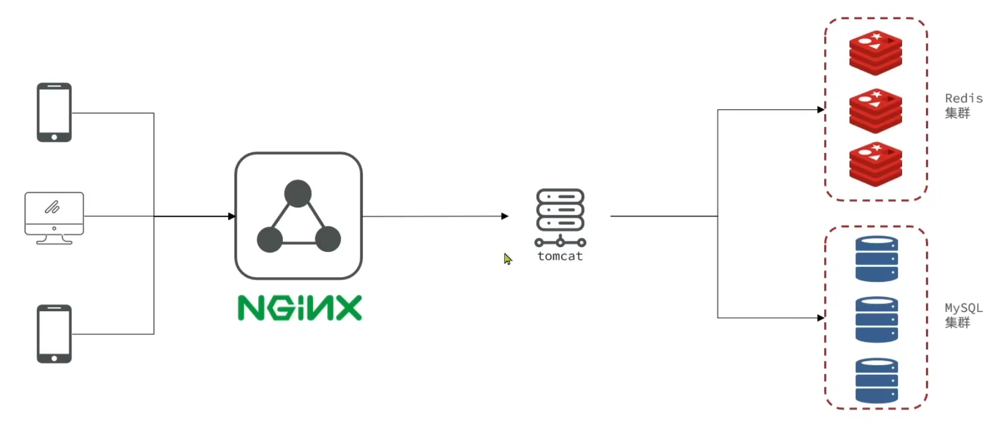
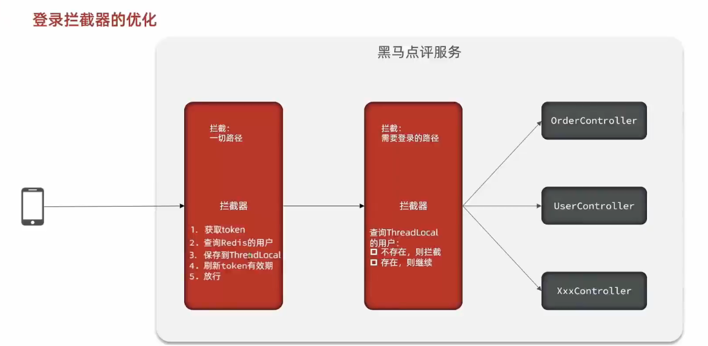
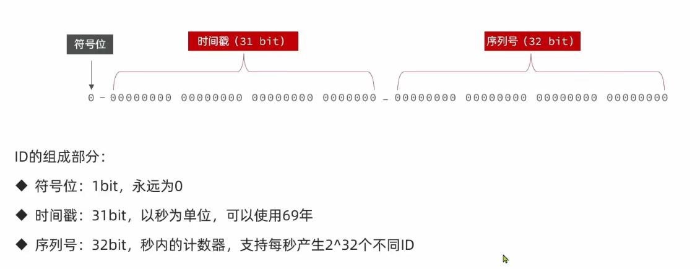

前端启动，进入nginx目录，运行起来nginx即可


## 短信登录

1. 发送短信验证码

	提交手机号 -> 校验手机号 -> 生成验证码 -> 保存验证码到session里 -> 发送验证码 -> 结束

2. 短信验证码登录、注册

	提交手机号和验证码 -> 校验验证码 -> 用户是否存在 -> 把用户保存到session（存在），不存在则创建一个新用户（保存用户到数据库）

3. 校验登录状态

	请求并携带cookie -> 从session获取用户 -> 判断用户是否存在 -> 没有则拦截，有则把用户保存到ThreadLocal（目的是把当前登录用户绑定到当前请求线程上，后续无需传request等，方便再一次请求内部传递当前用户），再放行


session共享问题：多台Tomcat并不共享session存储空间，当请求切换到不同的tomcat服务时导致数据丢失的问题

Redis代替session需要考虑的问题：

+ 选择合适的数据结构
+ 选择合适的key
+ 选择合适的存储粒度（用户信息脱敏）




短信登录功能反思：

存在redis中的信息：

验证码以及登录用户的信息

解决分布式问题

ThreadLocal，减少单次请求中对User的查询

双拦截器设计：因为有的接口不拦截，但是我们需要在每个请求来了之后刷新token

把用户信息也存在redis中了，也是解决session分布式的问题，和鱼皮解决的问题一样


## 商户查询缓存

数据交换的缓冲区，是存储数据的地方，一般读写性能较高

浏览器缓存：保存一些css，js之类的

应用层缓存：把数据放内存

好处：

+ 降低后端负载
+ 提高读写效率，降低响应时间

成本：

+ 数据一致性成本
+ 代码维护成本
+ 运维成本


在客户端和数据库中间增加一个Redis中间层

店铺列表可以做一个缓存


**缓存更新策略**

一致性问题，如果数据库更改了，缓存中的就错了

|              | 内存淘汰                                                     | 超时删除                                                     | 主动更新                                     |
| ------------ | ------------------------------------------------------------ | ------------------------------------------------------------ | -------------------------------------------- |
| **说明**     | 不用自己维护，利用 Redis 的内存淘汰机制，当内存不足时自动淘汰部分数据。下次查询时更新缓存。 | 给缓存数据添加 TTL 时间，到期后自动删除缓存。下次查询时更新缓存。 | 编写业务逻辑，在修改数据库的同时，更新缓存。 |
| **一致性**   | 差                                                           | 一般                                                         | 好                                           |
| **维护成本** | 无                                                           | 低                                                           | 高                                           |

- **低一致性需求**：使用内存淘汰机制。例如店铺类型的查询缓存。
- **高一致性需求**：主动更新，并以超时删除作为兜底方案。例如店铺详情查询的缓存。


**主动更新策略**

1. 由缓存的调用者，在更新数据库的同时更新缓存
2. 缓存与数据库合为一个服务，由服务来维护一致性。调用者调用该服务，无需关心缓存一致性问题
3. 调用者只操作缓存（增删改查全在缓存中做），由其它线程异步的将缓存数据持久化到数据库，保存最终一致


常见策略是第一种，以下是针对第一种方案的思考：

操作缓存和数据库时有三个问题需要考虑：

1. 删除缓存还是更新缓存？

- 更新缓存：
  - 每次更新数据库都更新缓存
  - 无效写操作较多 ❌

- 删除缓存：
  - 更新数据库时让缓存失效
  - 查询时再更新缓存 ✅


2. 如何保证缓存与数据库的操作的同时成功或失败？

- 单体系统：
  - 将缓存与数据库操作放在一个事务

- 分布式系统：
  - 利用 TCC 等分布式事务方案


3. 先操作缓存还是先操作数据库？（线程安全问题）

- 先删除缓存，再操作数据库（删缓存之后，另一个线程又写缓存，然后数据库才更新完成，所以出现了缓存和数据库数据不一致的情况）

- 先操作数据库，再删除缓存（可能查到旧数据，但可能性低于上一种）


**缓存穿透**

是指客户端请求的数据在缓存中和数据库中都不存在，这样缓存永远不会生效，这些请求都会打到数据库

常见的解决方案有两种：

+ 缓存空对象：字面意思
	+ 优点：实现简单，维护方便
	+ 缺点：
		+ 额外的内存消耗
		+ 可能造成短期的不一致
+ 布隆过滤：请求先走到布隆过滤器中，如果数据不存在则拒绝，存在则放行，是一个二进制，但是好像并非百分百准确
	+ 优点：内存占用较少，没有多余key
	+ 缺点：
		+ 实现复杂
		+ 存在误判可能


缓存穿透产生的原因：

用户请求的数据缓存和数据库里都没有

解决方案：

+ 缓存null值
+ 布隆过滤

+ 增加id的复杂度，避免被猜测id规律

+ 做好数据的基础格式校验

+ 做好热点参数的限流

+ 加强用户权限校验


**缓存雪崩**

指同一时段内大量的缓存key同时失效或者Redis服务宕机，导致大量请求到达数据库，带来巨大压力

解决方案：

+ 给不同的key的TTL添加随机值
+ 利用Redis集群提高服务的可用性
+ 给缓存业务添加降级限流策略
+ 给业务添加多级缓存


**缓存击穿**

也叫热点key问题，就是一个被高并发访问并且缓存重建业务较复杂（重建时间长）的key突然失效了，无数的请求访问会在瞬间给数据库带来巨大的冲击

常见的解决方案有两种：

+ 逻辑过期（永不过期，确实，常用的东西可以不过期）逻辑维护一个时间存入，查缓存的时候，发现逻辑时间已经过期了，就开始重建，也要拿锁，然后开个新线程，让新的线程去更新数据，结束后释放锁，本线程直接返回旧数据。后续别的线程来了，发现没拿到锁，直接返回旧数据即可（但是一致性会差一点）
+ 互斥锁（不让大家都来重建，一个人就行了，降低数据库压力）很多线程在等待，性能很差，但是一致性很好


两种解决方案是一致性和可用性的抉择


**基于互斥锁解决缓存击穿问题**

针对根据id查询商铺的业务

锁放redis中就已经是分布式锁了

尽量不对原本的代码进行侵入


**缓存工具封装**

有一些传递参数的逻辑不错

比如这里的泛型，然后type类别，还有操作数据库的函数接口

`public <R, ID> R queryWithLogicalExpire(String keyPrefix, ID id, Class<R> type, Function<ID, R> dbFallback, Long time, TimeUnit timeUnit)`


## 优惠券秒杀

订单表id，没有使用自增长

+ id的规律性太明显
+ 受表单数据量的限制（后续订单量大分表不方便）


**全局ID生成器**

是一种在分布式系统下用来生成全局唯一ID的工具，一般要满足下列特性：

唯一性；高可用；高性能；递增性；安全性

为了增加ID的安全性，可以不直接使用Redis自增的数值，而是拼接一些其它信息：



全局唯一ID生成策略：

+ UUID
+ Redis自增
+ snowflake算法
+ 数据库自增

Redis自增ID策略：

+ 每天一个key，方便统计订单量
+ ID构造是时间戳 + 计算器


**实现优惠券秒杀下单**

每个店铺都可以发布优惠券，分为平价卷和特价券。平价卷可以任意购买，而特价卷则需要秒杀抢购

```java
@TableField(exist = false)
    private LocalDateTime endTime;
```

这个注解让前端可以传参，但Mybatisplus不做映射

涉及多表写操作时，开启事物


**乐观锁解决超卖问题**

多线程情况下的问题，交叉执行，查询库存出了问题

加锁

悲观锁

认为线程安全问题一定会发生，因此在操作数据之前先获取锁，确保线程串行执行

+ 例如Synchronized、Lock都属于悲观锁

乐观锁

认为线程安全不一定会发生，因此不加锁，只是在更新数据时去判断有没有其它线程对数据做了修改

+ 如果没有修改则认为是安全的，自己才更新数据
+ 如果已经被其它线程修改说明发生了安全问题，此时可以重试或异常


乐观锁

关键是判断之前查询得到的数据是否被修改过，常见的方式有两种：

+ 版本号法：查询和修改都同时操作库存和版本号，然后通过版本号判断有没有人修改过
+ CAS法：观察到可以直接用库存代替这个版本号，省略了版本号


```java
boolean success = iSeckillVoucherService.update()
                .setSql("stock = stock - 1")
                .eq("voucher_id", voucherId)
                .gt("stock", 0)
                .update();
```

没必要非用版本号，在秒杀场景下直接判断stock是否大于0即可了，用版本号容易导致失败率过高（可以用分段锁解决这个问题，就是分很多个表，然后让用户去不同的表里抢，这样就相当于搞了是个版本号）


**实现一人一单**

需求：同一个优惠券，一个用户只能下一单

根据优惠券id和用户id做订单查询，判断订单是否存在

欸，这样做就错了

因为查这个数量和更新库存不是原子的，可能有多个线程过了判断数量这个逻辑

多线程穿插问题

直接上悲观锁，锁userId

但是synchronized是单机锁，分布式不可以，要用分布式锁

锁监视器是单JVM的

## 分布式锁

